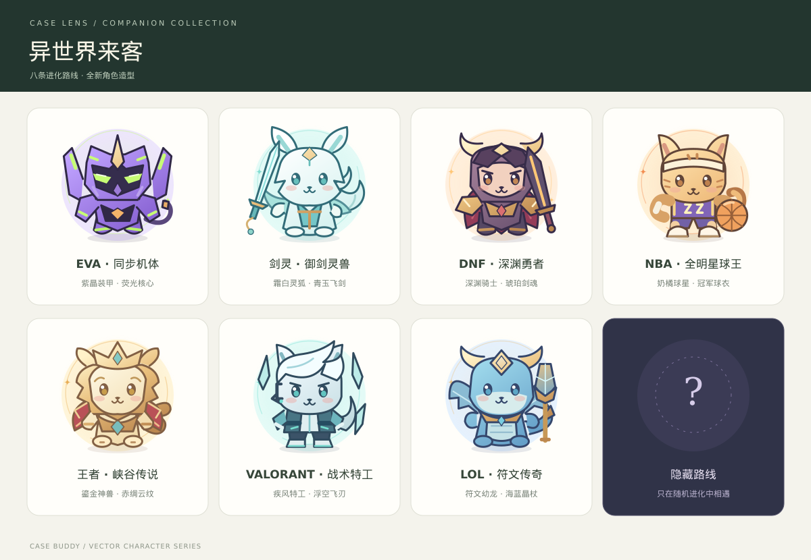

# LLM Log Case Viewer

浏览器本地优先、也可部署为内网多人平台的 JSONL 日志查看与多模型人工标注工具，兼容 OpenAI 与 Anthropic 常见消息结构。

## 主要功能

- 拖拽或选择 `.jsonl` / `.json`，坏行单独提示，不影响其他 Case
- 自动识别 OpenAI、Anthropic 消息、Thinking、Tool Call 与 Tool Result
- 按 ID、模型、协议、消息内容搜索和筛选
- 查看对话轨迹、Tools Schema、原始 JSON，复制或导出 Case
- 大列表分批渲染，大型 JSONL 让出主线程分批解析
- `⌘/Ctrl + K` 聚焦搜索，方向键切换 Case
- 使用本地模型或外部 OpenAI-compatible API 翻译、摘要、双语摘要和自定义分析
- 支持当前 Case、单条消息或当前筛选结果批量处理
- 执行前估算 Token、分片和请求次数；按模型上下文窗口自动计算安全输入预算
- 翻译逐段完整处理并按原顺序拼接；摘要采用分段提炼 + 多层合并，不静默抽样
- AI 结果历史、复制及 JSONL 批量导出；结果按数据集保存在浏览器中，刷新页面仍可继续查看
- 并排查看多个模型的 reasoning、final response 和元数据
- 多用户按可配置维度评分、备注、Badcase 与错误标签
- 编辑评分、标签或备注后 1 秒自动暂存；团队模式串行保存并用 revision 防止覆盖冲突
- 导出带标注的完整 JSONL，或只导出扁平标注记录
- 内网团队模式：账号登录、管理员创建/归档/删除项目，创建/停用账号与重置密码
- 项目成员隔离：标注员只看到自己加入的项目和分配给自己的 Case
- 支持按 Case ID 指定或按数量随机分配，可允许多人重叠；也可取消指定任务、清空用户任务或重置项目分配
- 项目级评分维度与 Badcase 标签配置、盲标开关、提交锁定、管理员进度面板和标注退回
- 指标看板可按“总体 / Agent / 非 Agent”切换 Case 口径；模型汇总、标注员明细、完整 Case 数和评分完整率会一起重算，并按“标注员 + 候选”只采用最新修订，避免历史重复记录造成重复计分
- 快速标记“无法判断/数据问题”、上一条/下一条，以及完成整条 Case 后自动前往下一条未完成
- 导入前整文件校验，失败时不修改旧数据；完整 Case / 扁平标注两种导出均可选择是否包含草稿
- 右侧问答支持 Markdown 标题、列表、代码块、表格与安全链接；桌面端打开后压缩主工作区，不再遮挡 Case 内容
- 团队模式支持三阶段 LLM-as-Judge：管理员统一配置模型与 Prompt，每位用户通过自己电脑的本机中继运行，结果回传服务器共享、去重并保留历史
- 自动判分按 Case 内容、候选回复和配置版本分别计算指纹；只修改一个候选时仅该候选结果失效，历史人工标注不受影响
- Stage 1 可单独生成；每个候选模型的 Stage 2+3 可分别生成或重跑，最新可用结果可加入右侧问答上下文，不会覆盖人工评分
- Case 存在已提交的历史人工评分后，可运行“历史评分自检”：重点比较人工与自动判分的跨档差异，反查 Stage 1/2/3 并提炼可复用的 Prompt 优化细则；同档细微分差默认忽略
- 自检结果可带入右侧问答继续推敲；项目成员可结合自检和对话生成测试版 Prompt。Prompt 工作台支持完整查看与编辑、草稿/测试/生产状态、父版本与自检来源、版本差异、发布及保留历史的回退
- 所有项目成员都可创建多个个人 Prompt 版本并选择自己的默认版本；私有版本仅本人和管理员可见，推送给团队后其他成员可载入或设为默认。只有管理员可以修改模型运行参数并发布全项目生产版本
- 可收起的“标注搭子”：可重命名、换颜色和配饰；摸摸、完成标注及发现 Badcase 会获得经验并升级解锁装扮
- 宠物持续进化系统：每次升级积攒一张进化券；单抽具有动态保底并沿当前路线持续强化；已有路线后可消耗 5 张进化券改抽另一条路线，新路线从第 1 次进化重新开始；进化还会随机觉醒技能
- 宠物装备与技能：摸摸、提交标注、发现 Badcase 均可能触发装备掉落；每次从 3 件同稀有度候选中选择 1 件，界面会提供仓库数量、合成缺口、主题收藏、套装档位与同部位穿戴对比，随机词条领取后才鉴定。图鉴包含 300 件、5 个穿戴部位和 5 档稀有度。装备仓库支持点击穿戴部位筛选、套装筛选，以及套装/部位、战力、等级、稀有度和库存数量排序；套装收集册会按 12 个主题展示已获得的具体装备。3 件同名装备可概率合成至 Lv.10，并生成可暴击、可重复叠加的随机效果词条；还可消耗同名材料洗练词条，或将任意装备分解为零件后进行二合一随机熔铸，熔铸后会弹出装备、幸运升级和鉴定词条结果。每件装备都有固定效果，同主题 2/3/5 件可激活套装共鸣，并提供独立的装备构筑攻略页
- 团队宠物家园：查看其他团队账号宠物的毛色、配饰、进化路线、装备、套装与启用技能；每个账号每天可随机切磋一次，战力严格高于对手时获胜并保证获得一组装备三选一，挑战失败仍有 10% 概率掉落，平局不掉落

宠物经验规则：每次摸摸 `+0.2 EXP`、每小时最多获得 `2 EXP`；首次提交某个候选模型的标注 `+6 EXP`，首次将该结果标为 Badcase 再 `+4 EXP`。同一标注事件不会重复计分；团队模式按账号保存在数据库，本地模式保存在当前浏览器。等级上限为 Lv.50：Lv.1–5 沿用原成长曲线，Lv.5 后每级固定需要 `140 EXP`，并逐步解锁颜色、配饰和专属称号。

宠物工作室分为“进化抽奖 / 装备 / 技能 / 外观与等级”四个区域。进化单抽基础成功率为 10%，每次连续失败都会提高保底，成功后重置；首次进化可用 5 张进化券保证成功。已有路线后再次使用 5 张进化券，会随机切换到一条不同路线，并清空旧路线的进化层级与路线特征，从新路线第 1 次进化重新开始；装备、已觉醒技能和历史记录保留。普通单抽成功时仍有 12% 概率暴击双重进化。路线共 17 条：原有星辉、机甲、森灵、风暴、潮汐、火焰、云梦、像素、歪歪异变体，新增 EVA、剑灵、DNF、NBA、王者、VALORANT、LOL 七条主题路线和一条隐藏路线。各路线有独立外观与进化特征；隐藏路线在图鉴中显示问号，仅可随机获得，不可十券定向选择。团队账号首次进化、五券换路线及十券定向均不会新增与其他账号相同的路线；没有空闲路线或定向目标被占用时，在扣券前提示。老账号已有路线保持不变，本地模式只管理当前浏览器宠物。换路线成功时，旧路线每级补偿 2 次大转盘；十券定向失败保留原路线，并累计同目标保底。已有账号首次使用时，会按当前等级补发 `等级 - 1` 张进化券。

新增八条路线使用完整矢量角色，按初号机、灵族灵剑士、鬼剑士、篮球球星、梦奇、捷风、阿狸及原创隐藏星灵的主题特征设计。1 / 3 / 6 / 9 / 12 / 15 阶有各自的外观里程碑，每次成功进化更新阶数徽记；进化页可预览当前路线的六个阶段。前后端新增路线词条与阶段同步，已有历史记录保留。工作室、标注搭子、家园、切磋及衣柜共用同一套角色画面；隐藏路线在获得前只显示问号。毛色映射到核心、头带或服饰点缀。

“小镜暖暖”12 个主题的帽子、衣服、披肩和手持物采用独立矢量轮廓，按基础小镜与进化角色分别对齐；圆头鞋保留原有样式。套装、单件与收藏使用相同绘制部件，支持混搭和原有试穿/保存流程；时装 ID、解锁等级与收藏数据保持兼容。

[鬼剑与灵狐重绘对照](docs/pet-character-refinement.png) · [进化阶段对照](docs/pet-route-evolution.png) · [十二套时装预览](docs/wardrobe-preview.png) · [设计与验证说明](docs/pet-visual-design.md)




装备图鉴由 12 个主题、5 个部位和 5 档稀有度组合生成，共 300 件。摸摸基础掉率为 5%，每个候选首次提交为 18%，首次标记 Badcase 可按 20% 额外再抽一次；技能和已穿戴装备会继续加成。触发掉落后会生成 3 件不同但稀有度相同的候选，用户选择其中 1 件；选择前隐藏随机词条，但展示固定效果、同名库存和等级、领取后的合成缺口、同主题仓库/穿戴数量、套装下一档及同部位当前装备。未领取的掉落会保存在账号或本地浏览器中，最多排队 10 组。领取时才鉴定并追加 1 条随机词条；重复装备同时增加同名材料，不会自动升级。“图鉴学者”技能改为提高三选一装备的稀有权重，不再强制提高同名掉落倾向。旧账号在原规则下已获得的等级会原样保留。每次合成需要至少 3 件同名装备并消耗其中 2 件，成功后提升 1 级，最高 Lv.10；失败会保留主装备、等级与现有词条，并为下次累计 5% 保底（最多 +30%）。每次合成都会显示需手动关闭的成功或失败结果弹窗，包括材料消耗、剩余库存；成功显示升级结果和新增词条，失败显示等级保留和下次成功率。合成成功会生成随机效果词条，有 18% 概率词条数值暴击、15% 概率额外生成一条；词条类型允许重复，最多保留 24 条。洗练消耗 1 件额外的同名装备，保留装备等级与合成保底，随机替换全部词条，并同样有机会增加一条。任意未穿戴装备可逐件分解，每件获得 1 枚熔铸零件；消耗 2 枚零件会随机铸成 1 件装备并鉴定 1 条词条，结果装备有独立 1% 概率额外提升 1 级（最高 Lv.10）。不同部位分别提升全局装备掉率、摸摸/标注/Badcase 专属掉率或单抽进化概率；随机词条还可提供这些效果或稀有装备权重。星尘、森林、雷云、海盐、琥珀、月影、霓虹、机械、云朵、蜂蜜、像素、纸片 12 套分别拥有不同的 2/3/5 件效果组合，覆盖稀有权重、各来源掉率及进化概率；装备页可查看完整套装图鉴，三选一会提示所选主题的下一档实际效果。每次进化成功还会随机觉醒或升级一个技能，最高 Lv.5，最多同时启用 3 个。已登录管理员可在“进化抽奖”页多选管理员或标注员，并可一键全选全部标注员，按每人 1–50 张批量发放进化券；无需再次输入密码，每位接收人的发放仍会留下服务端审计记录。

顶部“宠物家园”仅在团队账号登录后同步真实邻居。战力由宠物等级、进化次数、已穿戴装备、启用技能和已激活套装档位共同组成，界面会展示自己的战力拆分与家园排行。每日战斗按北京时间自然日计算，由服务端随机选择一名其他有效账号；己方战力严格高于对方才算胜利，战力相同按平局处理。胜利会保证生成一组来源为“家园战斗”的装备三选一并优先展示；挑战失败有独立 10% 概率生成同样的意外掉落，平局不掉落，随机词条仍要等领取后才揭晓。三种结果都会消耗当日机会。家园次数、最近 20 次战斗记录、待领取装备和熔铸零件均复用现有宠物库存 JSON 的保留字段保存，不新增数据库表，也不改变旧宠物数据结构。

## 在线使用

[打开 Case Viewer](https://llm-log-case-viewer.qingyangjiang-aq.chatgpt.site)

日志文件在浏览器内读取和解析，不上传到本站服务端。仅当你主动执行 AI 任务时，选中的文本才会发送到配置的模型地址。

在线地址是前端功能演示，不连接你的内网数据库。正式多人标注请按下文使用 Docker Compose 部署。

## 内网一键部署

不需要域名。只要标注用户能访问服务器内网 IP，即可通过 `http://<服务器内网IP>:8080` 使用。

要求：Linux x86_64/ARM64 服务器、Docker Engine 24+、Docker Compose v2；建议至少 4 核 CPU、8 GB 内存，并为数据预留足够磁盘。

```bash
git clone https://github.com/QingyangJiang/llm-log-case-viewer.git
cd llm-log-case-viewer
cp .env.example .env
```

先编辑 `.env`，至少替换 `POSTGRES_PASSWORD` 和 `ADMIN_PASSWORD`。然后执行：

```bash
bash scripts/preflight-deploy.sh
docker compose up -d --build
docker compose ps
curl http://127.0.0.1:8080/api/health
```

健康检查返回 `{"status":"ok"}` 后，在其他内网机器打开 `http://<服务器内网IP>:8080`。点击右上角“团队模式”，用 `.env` 中的管理员账号登录；创建项目、打开项目、上传 JSONL，再创建标注员账号。

部署包含四个容器：Nginx（唯一暴露端口）、前端、FastAPI、PostgreSQL。PostgreSQL 不对外开放；数据库、上传文件和导出数据分别持久化在 `./data/postgres` 与 `./data/app`。重启容器不会丢失。

常用运维命令：

```bash
# 查看状态和日志
docker compose ps
docker compose logs -f --tail=200

# 更新代码并滚动重建
git pull --ff-only
docker compose up -d --build

# 停止服务（保留数据）
docker compose down

# PostgreSQL 逻辑备份
docker compose exec -T postgres pg_dump -U case_lens case_lens > data/case-lens-backup.sql
```

注意事项：

- 不要执行 `docker compose down -v`，也不要删除 `data/`，除非确认要清空全部数据。
- 若修改了 `POSTGRES_USER` / `POSTGRES_DB`，备份命令中的名称也要同步修改。
- HTTP 内网部署请保持 `SECURE_COOKIES=false`；未来接入 HTTPS 后改为 `true`。
- 防火墙只需向可信内网开放 `APP_PORT`。可修改 `.env` 中的 `APP_PORT`，例如 `8090`。
- 当前是轻量账号体系：管理员负责创建用户、项目成员和 Case 分配；暂未包含 LDAP/SSO 和密码自助重置。
- 管理员“上传更新”会按稳定的 Case ID 和 candidate ID 原地更新；已有标注、任务分配和未变化内容的判分结果会保留。仍建议更新前备份数据库。

### 团队任务配置流程

1. 管理员创建标注员账号和项目，打开项目后上传 JSONL。
2. 在“项目成员与标注策略”中勾选允许参与该项目的标注员。未加入项目的账号看不到项目。
3. 在“Case 分配与进度”中选择标注员：
   - 输入数量后随机分配；默认不会与其他人的任务重叠。
   - 开启“允许重复”可把同一 Case 分给多人，用于双人盲标或一致性检验。
   - 输入一个或多个 Case ID 可精确指定；也可一键填入管理员当前查看的 Case。
   - “替换已有分配”会先撤销该标注员在项目内的旧任务，再写入本次结果。
4. 默认开启盲标：标注员只能看到自己的评分与备注；管理员可查看全部记录与整体进度。
5. 可选开启“提交后锁定”。管理员在 Case 的标注历史中可将已提交记录退回草稿。

### 三阶段自动判分

1. 管理员打开团队模式和目标项目，在“自动判分配置”中统一填写协议、模型名称、本机中继地址、三个阶段 Prompt 与运行参数；推荐中继地址固定为 `http://127.0.0.1:19001/v1`。
2. 每位管理员或标注员都要在自己的电脑启动 `scripts/model_cors_relay.py`，在团队面板填写自己的 API Key，并点击“测试我的本机中继”。Key 只存在当前页面内存，不保存到服务器。
3. 配置 Anthropic `/messages` 或 OpenAI-compatible `/chat/completions` 协议，按需调整三个阶段的温度、最大输出、并发 Case 数与阶段三采样次数。管理员保存后会生成新的项目配置版本。
4. 标注员可先单独点击“生成 Stage 1”，再按需为任一模型点击“生成 Stage 2+3”；也可使用“一键生成全部”或在团队面板批量处理。真正的模型请求由该用户浏览器调用其电脑上的中继，运行期间必须保持网页与中继开启。
5. “模型结果与标注”页面先展示 Case 共用的 Stage 1，再通过模型摘要卡切换查看各模型的 Stage 2+3。Stage 2 默认收起，折叠标题直接汇总子任务数、问题数和状态分布；展开后可查看问题定位和正确点。Stage 3 默认展示最终状态、状态分布、逐条裁决、档位、分数与理由。三阶段 Prompt 沿用参考文档的结构，Stage 3 仅在末尾追加 `final_status` 输出要求；旧简版默认 Prompt 会升级为可追溯的新配置版本。重新生成 Stage 1 后，旧候选结果会保留并标记为需重新生成；结果在项目成员间共享。
6. 右侧问答可选择“引用最新判分”，引用当前 Case 已生成的 Stage 1 和各模型最新可用的 Stage 2+3；不要求全部模型完成后才能使用。
7. Case 至少有一条已提交人工评分、且至少一个模型完成 Stage 3 后，可点击“历史评分自检”。结果按 Stage 1/2/3 分栏展示候选优化细则；自检绑定当前评分和判分配置，评分变化后旧结果自动失效，避免误用过期结论。
8. 点击自检结果上的“带入问答继续优化”可让问答助手引用本次分档差异；项目成员还可点击“生成测试版 Prompt”。测试版不会影响项目生产版，可设为个人默认自行试用；管理员审阅后才能发布为全项目生产版。每次编辑、发布或回退都会保留独立版本与来源关系。
9. 非管理员也可在“Prompt 协作工作台”编辑 Stage 1/2/3、保存私有草稿或测试版，并将任一可见版本设为自己的默认。点击“推送给团队”后版本才会出现在其他成员的时间线中；普通成员不能借此修改模型、协议、并发或采样等管理员运行参数。

Case Lens 服务器只保存管理员配置和最终判分结果，不再连接模型服务，也不保存任何用户的判分 API Key。

从旧版本升级只需拉取代码并重建：

```bash
docker compose up -d --build
```

启动时会自动创建新的成员与任务分配表，不需要清空 PostgreSQL。已有 Case 和标注不会删除；升级后管理员需要先为旧项目配置成员与 Case 分配，标注员才能继续访问。

### GitLab 导入后脚本没有执行权限

如果构建前端时出现下面的错误：

```text
scripts/build-verified.sh: line 7: /app/scripts/sites-env.sh: Permission denied
```

原因是 `scripts/sites-env.sh` 没有可执行权限。GitLab 导入、压缩包解压或某些文件传输方式可能丢失 Git 的可执行位。先在项目根目录修复并确认权限变化：

```bash
chmod +x scripts/*.sh
git status --short
git diff --summary
```

如果权限此前确实丢失，输出中应出现类似内容：

```text
mode change 100644 => 100755 scripts/sites-env.sh
```

然后重新构建并启动：

```bash
sudo docker compose build --no-cache --progress=plain web
sudo docker compose up -d
```

当前项目的根目录 `Dockerfile` 已在构建时执行 `chmod +x scripts/*.sh`，即使源码传输过程中丢失权限，也会先修复权限再执行前端构建。为了让 GitLab 仓库本身永久保存正确的可执行位，可将权限修复提交到仓库：

```bash
git add Dockerfile
git add --chmod=+x scripts/*.sh
git commit -m "Fix build script permissions and package mirrors"
git push origin main
```

构建完成后检查容器、日志和后端健康状态：

```bash
sudo docker compose up -d
sudo docker compose ps
sudo docker compose logs --tail=100 web api
curl http://127.0.0.1:8080/api/health
```

健康检查正常时返回：

```json
{"status":"ok"}
```

## 数据格式

旧格式仍可直接查看：

```json
{"id":"case-001","messages":[...],"model":"gpt-5.4","tools":[...]}
```

也支持根节点为数组的普通 JSON 文件。

用于多模型标注时，推荐使用 `case-lens.annotation.v1`。JSONL 每行是一条独立 Case：

```json
{
  "schema_version": "case-lens.annotation.v1",
  "id": "case-001",
  "messages": [
    {"role": "system", "content": "You are a helpful assistant."},
    {"role": "user", "content": "用户问题"}
  ],
  "tools": [],
  "candidates": [
    {
      "id": "model-a",
      "model": "enterprise-9b",
      "label": "9B 企业模型",
      "reasoning": "模型思考过程；也可以是协议内容块数组",
      "response": "模型最终回复；也可以是协议内容块数组",
      "metadata": {"latency_ms": 1200, "tokens": 850}
    },
    {
      "id": "model-b",
      "model": "deepseek-v4-flash",
      "label": "线上中杯",
      "reasoning": "另一个模型的思考过程",
      "response": "另一个模型的最终回复"
    }
  ],
  "annotation_config": {
    "dimensions": [
      {"key": "correctness", "label": "正确性", "description": "事实与结论是否正确", "min": 1, "max": 5, "required": true},
      {"key": "relevance", "label": "相关性", "min": 1, "max": 5, "required": true}
    ],
    "badcase_tags": ["事实错误", "未遵循指令", "工具调用错误", "推理问题", "其他"],
    "model_order": ["deepseek-v4-flash", "enterprise-9b"]
  },
  "annotations": [
    {
      "annotation_id": "case-001:model-a:jiangqy",
      "annotator": {"id": "jiangqy", "name": "姜庆阳"},
      "candidate_id": "model-a",
      "scores": {"correctness": 4, "relevance": 5},
      "badcase": false,
      "badcase_tags": [],
      "note": "结论正确，但引用不够具体",
      "status": "submitted",
      "created_at": "2026-08-12T08:00:00.000Z",
      "updated_at": "2026-08-12T08:05:00.000Z"
    }
  ]
}
```

字段约定：

- `messages` / `tools`：所有候选模型共享的输入上下文，继续兼容原格式。
- `candidates`：同一 Case 的多个待评模型结果；`id` 在 Case 内唯一且稳定。
- `reasoning` / `response`：支持字符串、JSON object 或 OpenAI/Anthropic 内容块数组。
- `annotation_config`：每条 Case 可自定义评分维度；`model_order` 按 `candidate.model`（也兼容 `id` / `label`）配置候选展示顺序，未列出的候选保持 JSONL 原顺序并追加在后。
- `annotations`：可同时保存多名用户对不同候选模型的记录；唯一逻辑键为 `case id + candidate_id + annotator.id`。
- `status`：`draft` 表示暂存，`submitted` 表示完成。提交时会校验所有必填维度。

页面左侧可按未标注、草稿、已完成和 Badcase 筛选。本地模式的草稿保存在浏览器 `localStorage`；团队模式的草稿和提交均保存到 PostgreSQL，并带 revision 防止旧页面覆盖新版本。页面中的“下载输入模板”可直接获取一行示例。

## 本地运行

要求 Node.js `>=22.13.0`：

```bash
npm install
npm run dev
```

生产构建与检查：

```bash
npm run lint
npm test
```

## 连接本地模型

工具调用 OpenAI-compatible `/chat/completions` 接口。

Ollama 默认配置：

- Base URL：`http://localhost:11434/v1`
- Model：例如 `qwen3:8b`

若浏览器提示 CORS，可在可信本机环境中允许网页来源后启动 Ollama：

```bash
OLLAMA_ORIGINS=* ollama serve
```

vLLM / SGLang 常用 Base URL 为 `http://localhost:8000/v1`。线上 HTTPS 页面访问本地 HTTP 服务可能被浏览器拦截；遇到这种情况，推荐在本机运行 Viewer，或为模型服务配置 HTTPS / 可信代理。

## 连接 NIO Anthropic API

如果本机 `curl` 可以访问 `model.nioint.com`，但网关不允许 Case Lens 的浏览器 Origin，可在打开浏览器的同一台电脑运行仓库内的零依赖中继：

```bash
python3 scripts/model_cors_relay.py \
  --allowed-origin http://10.129.72.139:8080
```

中继只监听 `127.0.0.1:19001`，只接受配置的 Origin，并固定转发 `/v1/messages`。API Key 由当前浏览器请求携带，中继不会保存或输出 Key 和请求正文。启动后可检查：

```bash
curl http://127.0.0.1:19001/health
```

Case Lens 模型配置选择：

- 模式：`外部 API`
- 预设：`NIO 本机中继`
- 协议：`Anthropic · /messages`
- Base URL：`http://127.0.0.1:19001/v1`
- Model：实际模型 ID，例如 `DeepSeek-V4-Flash`
- API Key：仍只保存在当前页面内存

若 Case Lens 的 IP 或端口发生变化，需要用浏览器地址栏中的完整 Origin 重新启动中继。不要使用公开的通用 CORS 代理，也不要把中继绑定到公网地址。

## 大文件与上下文窗口

在 AI 面板的“上下文与输出”配置区填写模型真实支持的上下文窗口和输出 Token。两项均支持任意数值输入，上下文同时提供 4K–256K 快捷值。工具会扣除系统提示和安全余量，实时计算单段输入预算：

- 翻译：根据“单次最大输出”反推安全片段大小，为译文保留约输入 1.5 倍空间；所有片段依次调用并按原顺序拼接
- 摘要：先生成每个片段的摘要，再按上下文预算进行多层 Map-Reduce 合并
- 双语摘要：最后一层才生成中英双语结果，避免中间结果过长
- 自定义任务：仍是单次调用；超长时会明确标记首尾截断
- 如果完整处理需要的片段数超过安全上限，任务会被阻止并提示调整，不会通过抽样悄悄遗漏日志

Token 数是浏览器端对中英文混合文本的近似估算。建议上下文窗口填写真实值，并保留至少 1K–2K 输出空间；本地小模型可先从 8K 上下文、1K 输出预留开始。

## 隐私说明

- 日志加载、搜索、筛选和导出均在浏览器本地完成
- API Key 只保存在当前页面内存，不写入 localStorage
- 模型地址、模型名和长文本配置可以保存在当前设备
- 外部 API 模式会把本次选中的日志文本直接发送给配置的服务商
- 可在高级设置中排除 System / Developer、Thinking 或 Tools 定义

## License

MIT
# 将小镜当前穿搭导入 Codex

在「宠物工作室 → 衣柜」中点击「同步当前穿搭到 Codex」。导出的 PNG 为 Codex v1 动画表（1536 × 1872），首帧直接从当前衣柜角色的 DOM / SVG / CSS 绘制，包含当前人格路线、进化阶段、时装、基础配饰和已穿戴装备；可在按钮下方与衣柜角色对照。每次换装或进化后重新生成并安装，Codex 不会自动监听 CaseLens。

- **HTTPS 且已登录团队账号**：页面临时保存精灵图 30 分钟，点击「在 Codex 中安装当前穿搭」。Codex 必须能够读取该 HTTPS 图片地址；内网 HTTPS 地址仅在 Codex 所在电脑也能访问时适用。临时文件保存在 `data/app/codex-sprites`，旧文件在下一次上传时清理。
- **默认内网 HTTP 或本地模式**：浏览器下载同一 PNG。将 PNG 上传到可由 Codex 访问的 HTTPS 图片地址（需直接返回 PNG），把地址粘贴到页面，点击生成的安装链接。HTTP 图片地址无法用于 Codex 安装链接。

动画表的行对应待机、右跑、左跑、挥手、跳跃、失败、等待、工作、复核。各帧使用同一件穿搭和角色原图，通过位移、镜像和倾斜产生动作；首帧与衣柜预览同源。此功能不会把宠物进度、抽奖券或装备数值同步到 Codex。
