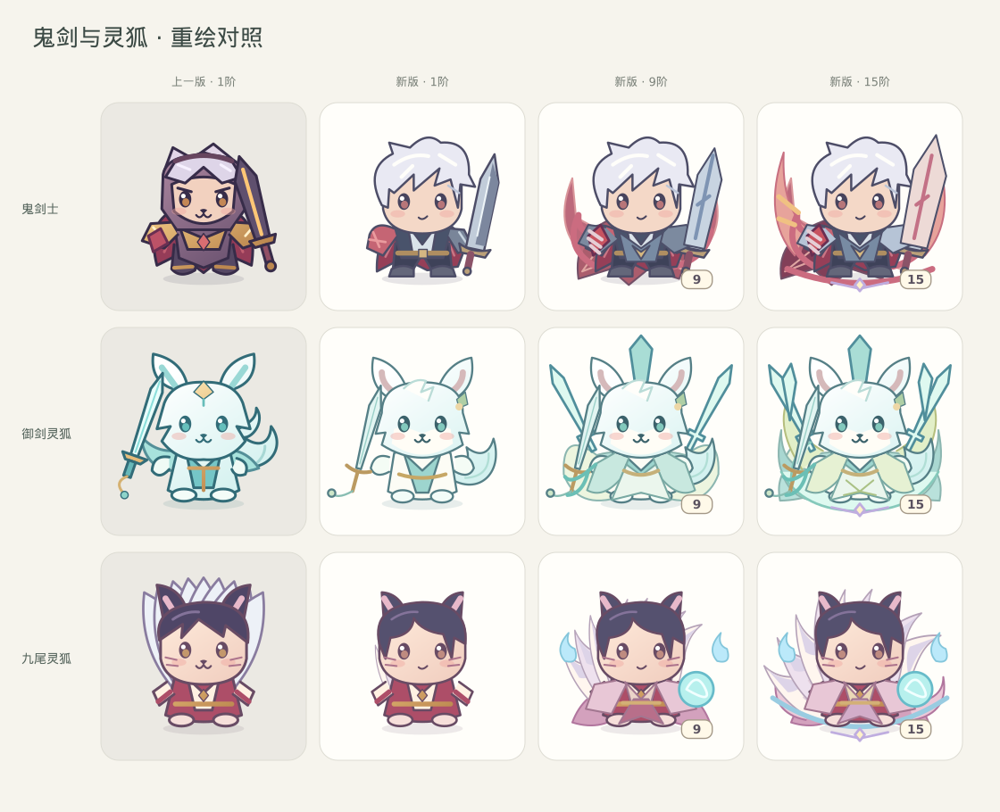
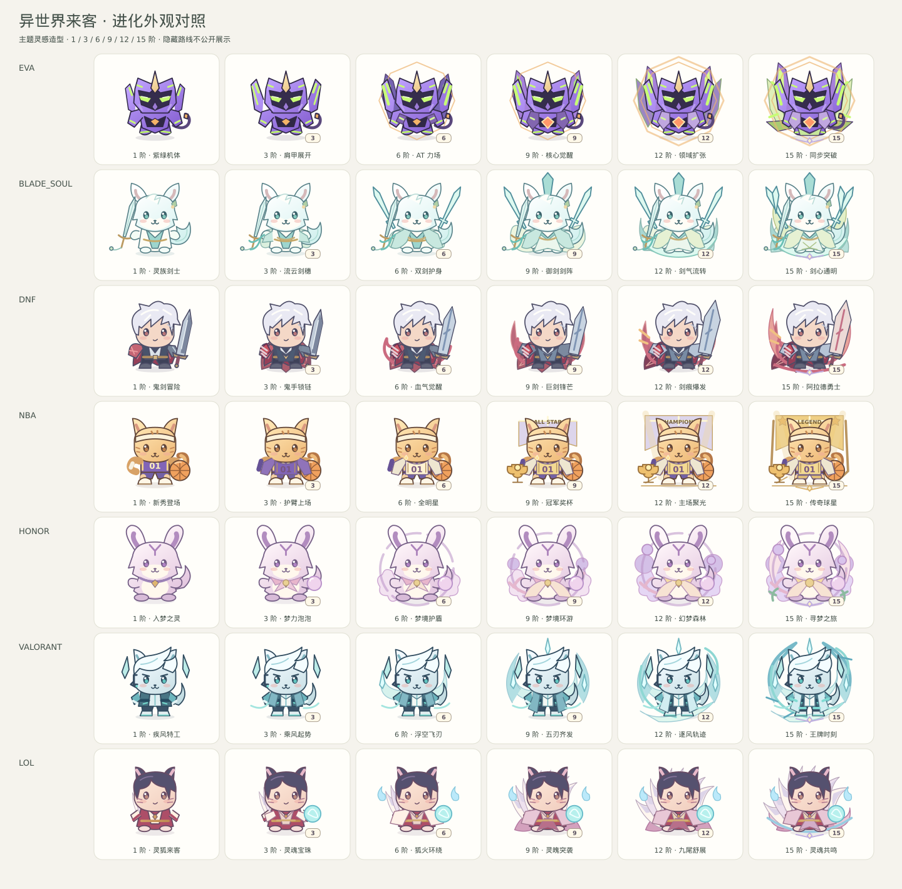
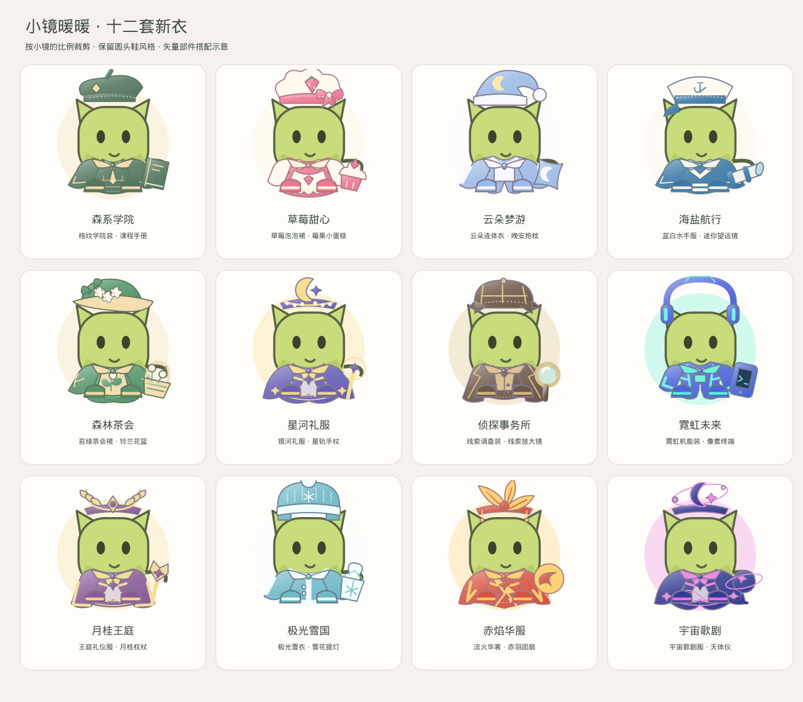

# 小镜路线与衣柜外观

本轮在小镜的比例上做主题灵感造型，统一脸部锚点，保持路线、时装和账户数据兼容。

## 第二轮外观细化

鬼剑士重画银发、脸型、护甲和剑，御剑灵狐重画耳朵、绒脸与弯尾，九尾灵狐改用柔和发型与弧形狐尾。高阶增加实质的装甲、宽袖、披摆、武器体量和展开轮廓；面部与脚部锚点保持稳定，已有时装可继续穿戴。NBA 使用队服、荣誉旗帜与奖杯，捷风使用战术服饰和风流形状。

12 套时装加入柔和面料渐变、同色系细描边和缝线；调整泡泡裙、层叠礼服、交领华服、圆袖外套，重新设计月相、月桂、凤羽、星轨头饰。圆头鞋的实际穿戴样式保留。



本轮仅修改前端绘制。若已部署 `0cbe66e`，只需重建 `web`；若尚未部署上一轮词条同步，仍需更新 `api` 和 `web`。类型检查、定向 ESLint、生产构建与 7 项前端测试通过；复核 48 个路线/关键阶段的画框边界，全部位于 160×160 画框内；衣柜、混搭预览的渐变 ID 和引用一致性检查通过。后端本轮无变动，以下 37 项后端测试结果来自上一轮验证。

## 路线定位

| 路线 | 识别特征 | 进化重点 |
| --- | --- | --- |
| EVA | 紫绿机体、单角、拘束肩甲、脐带电缆 | 肩甲展开、八边 AT 力场、核心、领域扩张 |
| 剑灵 | 灵族长耳、灵剑、剑穗、青玉装饰 | 双剑、剑阵、流转剑气 |
| DNF | 银发、红色鬼手、长剑 | 锁链、血气、巨剑与剑痕 |
| NBA | 球衣、护腕、篮球、球鞋 | 护臂、全明星标记、奖杯、主场聚光 |
| 王者 | 梦奇灵感的绒耳、额纹、信物 | 梦力泡泡、护盾、梦境环游 |
| VALORANT | 捷风灵感的白发、青蓝战衣 | 风势、飞刃、五刃、逐风轨迹 |
| LOL | 阿狸灵感的狐耳、九尾、红白灵衣 | 灵魂宝珠、狐火、狐尾展开 |
| 隐藏路线 | 原创星河主题 | 独立的六段外观；未获得时不展示角色或进化图 |

NBA 是篮球主题小镜，不指向特定球员。其路线进化使用运动荣誉元素。玩家主动选择的时装可以跨主题混搭。

核对角色设定时参考的官方资料：[捷风](https://playvalorant.com/en-us/agents/jett/)、[阿狸](https://www.leagueoflegends.com/en-us/champions/ahri/)、[梦奇](https://pvp.qq.com/web201605/herodetail/198.shtml)、[男鬼剑士](https://www.dfoneople.com/gameinfo/character/Slayer%28M%29)。

## 进化行为

八条新路线的外观与新获得词条按 1 / 3 / 6 / 9 / 12 / 15 阶分段。每个关键阶段累加专属图形；从 2 阶开始显示实际阶数徽记，因此中间阶段和 15 阶后的每次成功仍可见阶数变化。15 阶之后不承诺新增独立角色轮廓。

工作室展示当前路线的六段预览，并标记已达成和待进化。失败不改变外观；双重进化使用最终阶段绘制，词条按逐阶结算。旧九条路线维持原有规则，已存词条与历史不回写。



## 时装

12 个主题 / 60 件时装继续使用原有 ID、等级和收藏结构。头饰、套装、披肩、手持物使用实际图形；单品图标与穿戴部件共用绘制逻辑。服装针对基础小镜和八条矢量角色使用不同的垂直锚点。圆头鞋保留现有 CSS 形状与配色，调整基础小镜上的位置以适应衣服。

套装卡片加入当前小镜穿整套的预览；未解锁套装可查看，穿戴仍受原有等级限制。混搭、卸下、取消试穿、保存和收藏沿用现有流程。



## 验证与更新

- TypeScript、定向 ESLint、生产构建和 7 项现有前端测试通过。
- 37 项宠物后端测试通过，包含新路线阶段边界与旧路线词条节奏的回归检查。
- 渲染并检查进化、衣柜和八路线混搭对照；检查 72 个路线/阶段组合的 SVG 引用、唯一渐变 ID 与全部 60 个单品图标。
- 图片为矢量部件渲染示意；基础小镜与鞋子在示意图中用等比例 SVG 表示。当前环境无法访问本地服务进行完整浏览器交互验收，部署后需查看窄屏衣柜布局及试穿保存效果。

首次部署本轮及上一轮累计更新时，需同时更新 `api` 和 `web`，因为上一轮已将新路线词条与里程碑在服务端同步。无需数据库迁移，不修改 PostgreSQL 数据挂载。沿用既有 GitHub → GitLab 同步和数据库备份流程后执行：

```bash
sudo docker compose --progress=plain build --no-cache api web
sudo docker compose up -d --force-recreate --no-deps api web
sudo docker compose ps
sudo docker compose logs --tail=100 api web
curl -fsS http://127.0.0.1:8080/api/health
```
